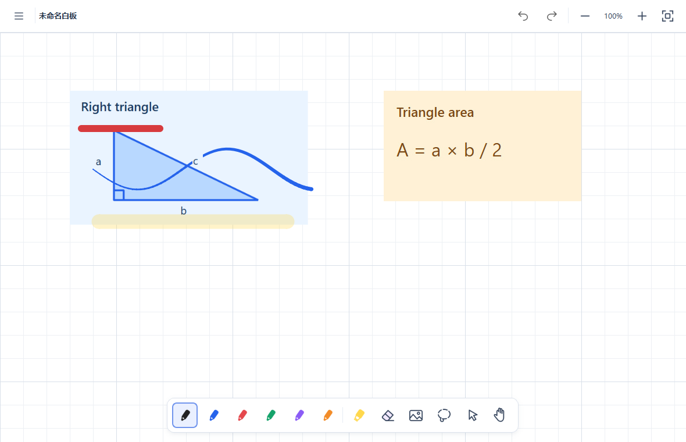

# SimpleBoard

[简体中文](README.md) | **English**

**A lightweight, offline Windows handwriting board that needs no sign-in, for people looking for a local alternative to Microsoft Whiteboard.**

Open it, write, then save your work or export it to share. SimpleBoard focuses on everyday handwriting, working through ideas, classroom notes, and meeting presentations.

Current version: **1.0.6 preview** · Target: **Windows 10 1809+ / Windows 11 x64** · License: **GPL-3.0-only**



The screenshot uses generated test strokes to demonstrate partial erasing, highlighting, and the grid. It does not show handwriting captured from a physical Surface Pen. The screenshot shows the Chinese interface; English is also available.

## Why SimpleBoard exists

SimpleBoard was created for people who want to open a desktop board and start writing, in response to Microsoft's announcement about retiring its standalone Whiteboard apps. It provides a simple local tool for handwriting and presentations.

Sometimes all you need is to work through a problem, sketch an idea, or explain something. There is no account registration or sign-in, everyday writing does not require a network connection, and you choose where to keep your board files.

Think of it as an alternative for **personal handwriting and local presentations**. It provides pens, a highlighter, erasing, lasso selection, zooming, saving, and exporting. Collaboration, cloud sync, and importing Microsoft Whiteboard files are outside the current scope.

> Background recorded in the Chinese README on October 6, 2026: Microsoft's announced retirement date for the standalone Windows, iOS, and Android apps is **October 16, 2026**. Work or school accounts can continue using Whiteboard in Teams and on the web. See [Microsoft's retirement notice](https://support.microsoft.com/zh-cn/whiteboard/retirement-standalone-microsoft-whiteboard-apps).

## Download and use

Source code and Windows portable packages are available on **GitHub** and **Gitee**. Choose whichever service is more accessible to you.

| Channel | Download location |
| --- | --- |
| GitHub | [Source repository](https://github.com/renbingcheng/simpleboard) · [Downloads](https://github.com/renbingcheng/simpleboard/releases/tag/v1.0.6) |
| Gitee | [Source repository](https://gitee.com/renbingcheng/simpleboard) · [Downloads](https://gitee.com/renbingcheng/simpleboard/releases) |

To use the app:

1. Open either downloads page above and read the release notes.
2. Download `SimpleBoard-<version>-win-x64-onefile.zip`, for example `SimpleBoard-1.0.6-win-x64-onefile.zip`.
3. Extract it and open `SimpleBoard.exe`. **No separate Python installation or runtime setup is required.**
4. Press `Ctrl+S` to save an editable `.qboard` file. Press `Ctrl+Shift+E` to export PNG or PDF for sharing.

The `source.zip` archive is for developers. To use the app directly, choose the Windows binary package above. The single-file app extracts runtime components into the system temporary directory when it starts; settings and recovery drafts live in the application data directory.

This is a preview. Physical Surface Pen behavior and compatibility across devices still need validation. Check the notes for the specific release for availability and known issues.

## Interface language

Open **☰ → 语言 / Language → English** in the upper-left corner to switch to English. Use **☰ → Language / 语言 → 简体中文** to switch back. The change takes effect immediately and is remembered across launches. Existing settings and new installations default to Simplified Chinese.

Menus, tool settings, tooltips, diagnostics, status messages, and application error/recovery dialogs are translated. Switching keeps your board, selection, view, and undo history. Your filenames, document contents, and diagnostic JSON field names are not translated. Native Windows file and color dialogs follow the operating system's language; Qt standard buttons use the app language.

From source you can also select a language at startup:

```powershell
.\.venv\Scripts\python.exe main.py --language en
.\.venv\Scripts\python.exe main.py --language zh_CN
.\.venv\Scripts\python.exe main.py --language en --help
```

The same `--language` option is available on `SimpleBoard.exe`. A startup choice becomes the saved preference when settings are next saved or the app exits normally. See [translation maintenance](CONTRIBUTING.en.md#translations-and-documentation) to add another language.

## Features

- Six configurable pen slots: color, width, pressure toggle, and sensitivity. Tap the active tool again to open its settings.
- Highlighter: a stroke does not darken where it crosses itself; separate overlapping strokes do darken.
- Partial and whole-stroke erasing. Partial erasing covers continuous paths between samples and keeps the vector document editable.
- Basic lasso selection, moving, and deleting. Fragments of a partially erased stroke remain one logical stroke and are selected together.
- One-finger panning, pinch zoom, middle-mouse panning, and wheel zoom. Zoom range: 10%–800%.
- Save and reopen `.qboard` documents, recover drafts after an unexpected exit, and undo/redo.
- Export PNG or vector PDF to a chosen folder. Exports show the **current view**, without toolbars, grid, selection outlines, or eraser cursor. Use “Fit all strokes” first to share the whole board.
- Full screen, a zoom guide grid, and input diagnostics that you can export manually.

The Surface Pen eraser end temporarily erases; its side button temporarily selects with the lasso. Touch navigation is suppressed while the pen is nearby; touch again after moving the pen away to resume navigation. Software regressions cover these behaviors, but pressure, palm rejection, side-button, and eraser-end behavior still require device testing.

Recent releases improve eraser-end handling and pressure smoothing. See the [changelog (Chinese)](CHANGELOG.md) for changes and validation limits.

## Common controls

| Action | Shortcut |
| --- | --- |
| New / Open / Save | `Ctrl+N` / `Ctrl+O` / `Ctrl+S` |
| Save as / Export PNG or PDF | `Ctrl+Shift+S` / `Ctrl+Shift+E` |
| Undo / Redo | `Ctrl+Z` / `Ctrl+Y` or `Ctrl+Shift+Z` |
| Six pen slots / Current pen | `1`–`6` / `P` |
| Highlighter / Eraser / Lasso / Pan | `H` / `E` / `L` / `V` |
| Delete selected strokes | `Delete` or `Backspace` |
| 100% / Fit all strokes | `Ctrl+0` / `Ctrl+1` |
| Zoom in / Zoom out | `Ctrl++` or `Ctrl+=` / `Ctrl+-` |
| Full screen / Input diagnostics | `F11` / `F12` |
| Exit full screen or deselect | `Esc` |

The upper-left ☰ menu contains saving, exporting, language selection, and “Always show grid”. By default the grid appears while zooming and fades afterward. It is not part of saved documents or exports.

## Saving, recovery, and local data

`.qboard` is the editable document format. PNG/PDF are for viewing and sharing and do not replace it. You choose the save location. Saving writes a temporary file in the same folder and then atomically replaces the target; a failed save does not deliberately truncate an existing file.

**Version 1.0.5 and the current version read formats 1 and 2, and always save format 2. Version 1.0.4 and earlier cannot open format 2.** Older strokes retain `legacy-v1` rendering; new strokes store `pressure-v2` and the input zoom scale, `input_scale`, so upgrading or changing the view does not replay them at a different width. Keep copies of original files if you need to return to an older app. Format 2 recovery drafts in the shared data directory also need the newer reader.

Recovery saving is triggered about 2 seconds after editing stops, or about every 10 seconds during continuous editing. Completion depends on document size and disk performance. A recovery draft is not a save to your chosen document; the title still shows unsaved changes. After an unexpected exit, the next launch offers recovery, discarding the copy, or handling it later.

Windows local data directory:

```text
%LOCALAPPDATA%\LocalWhiteboard\LocalWhiteboard
```

`settings.json` stores tools, language, and recent files; `recovery.qboard` stores the recovery draft; `whiteboard.log` records runtime errors. **SimpleBoard retains the legacy `LocalWhiteboard` organization and application names** to preserve settings, recovery drafts, and the single-instance lock. Rebranding does not move this data. Only one normal app instance can run at a time.

F12 input diagnostics are off by default. When enabled, the latest 512 native pen samples, Qt pen events, and operation boundaries are retained in memory. They are written to JSON only when you click “Export input log…”. The app has no telemetry or automatic uploads. Review your boards and diagnostics before sharing them.

## Current limits and validation

- No text boxes, image import, shapes, rulers, templates, collaboration, or Microsoft Whiteboard file compatibility yet.
- Pressure curves, smoothing, and erasing are this project's implementations, not copies of Microsoft's private Whiteboard algorithms.
- Physical Surface Pen input, palm rejection, screen rotation, cross-monitor DPI, suspend/resume, and real writing latency still need device acceptance testing. Windows synthetic input checks did not retain the expected eraser-end flag and **do not count as a successful native eraser-end end-to-end test**.
- Native eraser-end handling uses the Windows Pointer API, with Qt input retained when that API is unavailable. If a driver reports a real release and another contact, the app treats them separately instead of guessing continuity with a delay.
- Initial rendering of large documents and committing complex erases can pause. Tile cache: 128 MiB; geometry cache: 64 MiB; undo history: 200 operations. These are not limits on total process memory.
- PNG uses the current canvas's actual pixel size, affected by screen DPI. PDF preserves vector outlines with the current canvas aspect ratio.

The 1.0.5 release baseline reported 220 automated regressions plus source startup, save/reopen, and export checks. This historical result does not replace physical Surface testing or validation of a particular release package. The app remains a preview; physical devices, offline computers without development tools, and long-term stability still need acceptance testing. Binary distribution also requires addressing [third-party source delivery and rebuilding requirements (Chinese)](docs/THIRD_PARTY.md).

## Reporting issues

Once the repositories are public, use GitHub or Gitee Issues for problems and suggestions. Include the app and Windows versions, device and pen models, and steps to reproduce. For writing or erasing issues, describe mouse, pen-tip, and eraser-end behavior separately.

See [Contributing](CONTRIBUTING.en.md) for details.

## Run from source

Built with Python, PySide6 / Qt Widgets, and QPainter. Requires **Python 3.11 x64**. Open PowerShell at the project root:

```powershell
py -3.11 -m venv .venv
.\.venv\Scripts\python.exe -m pip install -r requirements.txt
.\.venv\Scripts\python.exe main.py
```

The first command uses the Windows Python Launcher. If `py` is unavailable, use an installed Python 3.11 interpreter to create the environment. Installing dependencies requires a working package source or prepared local packages. Whiteboard features work offline after installation.

You can also use the launcher script or supply a document:

```powershell
.\launch.ps1
.\launch.ps1 -Python .\.venv\Scripts\python.exe -Document '.\Lesson.qboard'
.\.venv\Scripts\python.exe main.py '.\Lesson.qboard'
```

Runtime dependencies are pinned to `PySide6==6.11.1` and `pyclipper==1.4.0`; see [requirements.txt](requirements.txt).

## Develop and package

```powershell
.\.venv\Scripts\python.exe -m pip install -r requirements-dev.txt
.\.venv\Scripts\python.exe -m unittest discover -s tests -v
.\build.ps1 -Python .\.venv\Scripts\python.exe
```

The default build produces `dist/SimpleBoard.exe`. Use `-Mode onedir` for a directory build useful for inspecting dependencies and debugging. Run `python scripts/package_source.py` to archive source. Packaging uses an explicit public-file inventory, including both README languages and both contribution guides, without depending on internal local notes.

Other documents: [Contributing](CONTRIBUTING.en.md) · [Changelog (Chinese)](CHANGELOG.md) · [Third-party dependencies (Chinese)](docs/THIRD_PARTY.md).

## License

The project uses **GPL-3.0-only** (GNU General Public License version 3 only). See [LICENSE](LICENSE) for the complete terms and the [official GNU GPL v3 text](https://www.gnu.org/licenses/gpl-3.0.html).

Third-party dependencies retain their own licenses and attribution; see [THIRD_PARTY_NOTICES.txt](THIRD_PARTY_NOTICES.txt) and [licenses/](licenses/). These notices remain separate from the project's GPL declaration.

SimpleBoard is independently developed and is not affiliated with or partnered with Microsoft. Microsoft Whiteboard is mentioned only to explain the project's background and intended use. SimpleBoard does not read or convert `.whiteboard` files.
